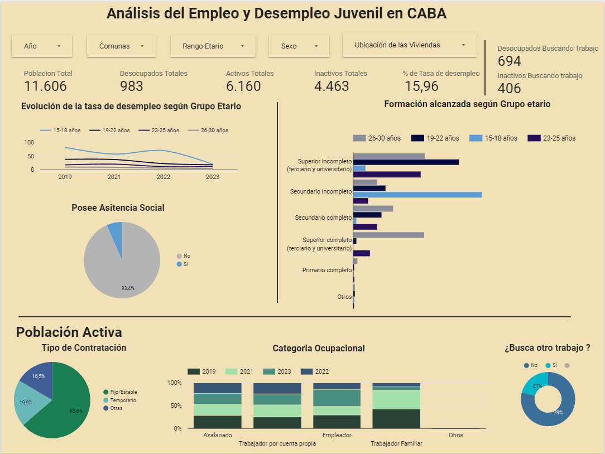

# Analisis del desempleo y empleo juvenil 

El proyecto tiene como fin Analizar la desocupación y las caracteristicas de la ocupación juvenil en la Ciudad Autónoma de Buenos Aires mediante un Dashboard en Looker Studio

## Dashboard

## 🔗 Link del Proyecto en Looker Studio

[Acceso Al Dashboard](https://lookerstudio.google.com/reporting/0b26b32f-efd6-45cb-a2be-6af0d0e20d81)
##  Herramientas Utilizadas

- Excel - para limpieza de datos

- Looker Studio - para la realización del dashboard 

## Datasets Utilizados

El proyecto se  realizó con los datos abiertos del Gobierno de la Ciudad de Buenos Aires.

- Encuesta Anual de Hogares 2023
- Encuesta Anual de Hogares 2022
- Encuesta Anual de Hogares 2021
- Encuesta Anual de Hogares 2020

